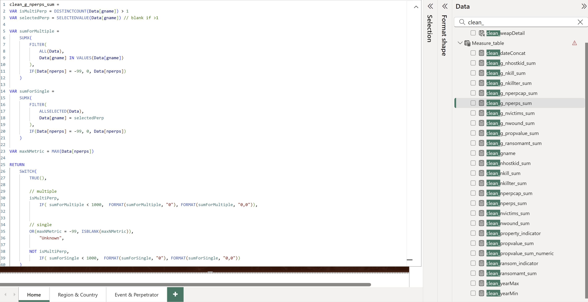

# Business Intelligence Dashboardshttps://github.com/lucacasu/BI-Dashboards/tree/main
**Dashboards leveraging open source data.**
 <br>
 <br>

**Tool:** Looker Studio / Google Analytics <br>
**Language:** SQL <br>
**Data:** Sourced from Google Merchandise Store. <br>
**Link:** https://lookerstudio.google.com/reporting/9e6bc7f0-0b00-44dd-9754-31a5d1aa41c9

This dashboard explores revenue sources, key store items and paid traffic performance. The user gets a snapshot of moth-to-date revenue figures with quarterly benchmark, followed by a custom-made brand and item breakdown, which was extracted in Looker from the product name field. The main store events (views, add-to-cart and purchases) are displayed by week, alonside the respective figures. The paid traffic summary shows all active campaigns ordered and colored by ROAS (Return on Ad Spending).


 <br>
 <br>


## Global Terrorism Database
**Tool:** PowerBI <br>
**Language:** DAX <br>
**Data:** Global Terrorism Database (GTD), START, University of Maryland – https://www.start.umd.edu/gtd <br>
**Link:** [....]


### Country facts
Here something.....


### Regional compasion
Here something.....


### Event and terrorrist group activity
Here something.....


### Measures
Here something.....



```sql
clean_g_nkill_sum = 
VAR isMultiPerp = DISTINCTCOUNT(Data[gname]) > 1
VAR selectedPerp = SELECTEDVALUE(Data[gname]) // blank if >1

VAR sumForMultiple =
    SUMX(
        FILTER(
            ALL(Data),
            Data[gname] IN VALUES(Data[gname])
        ),
        IF(Data[nkill] = -99, 0, Data[nkill])
    )

VAR sumForSingle =
    SUMX(
        FILTER(
            ALL(Data),
            Data[gname] = selectedPerp
        ),
        IF(Data[nkill] = -99, 0, Data[nkill])
    )

VAR maxNMetric = MAX(Data[nkill])

RETURN
    SWITCH(
        TRUE(),

        // multiple
        isMultiPerp,
            FORMAT(sumForMultiple, "#,##0"),

        // single
        OR(maxNMetric = -99, ISBLANK(maxNMetric)),
            "Unknown",

        NOT isMultiPerp,
            FORMAT(sumForSingle, "#,##0")
    )

```
