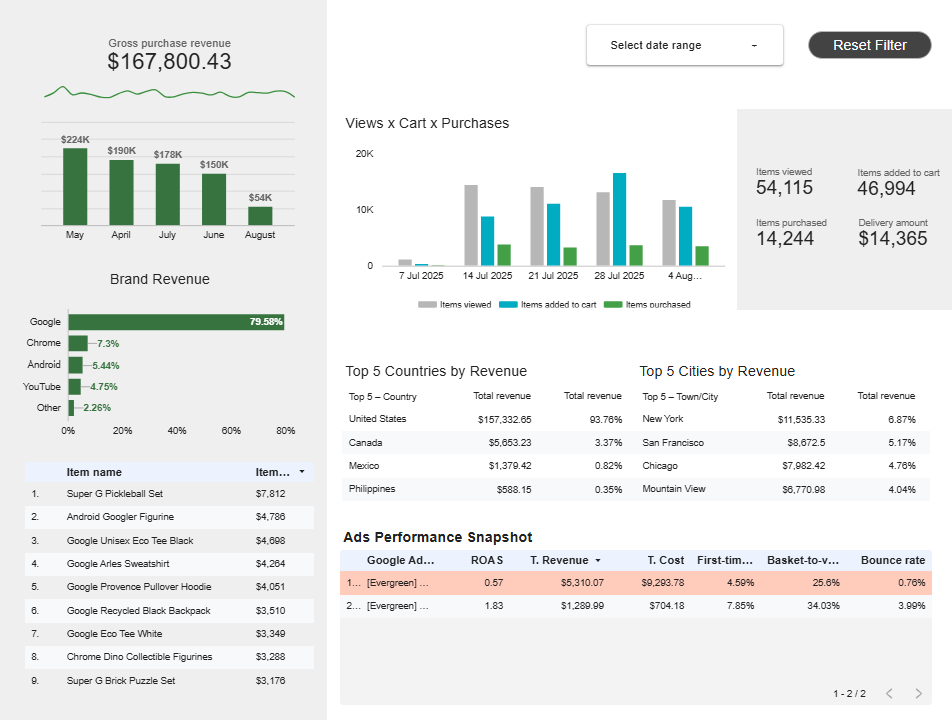

Dashboards
======
These projects leverage open source data. <br>
 <br>
 <br>


## ➜ Google Analytics data from Google's Merchandise Store
**Tool:** Looker Studio / Google Analytics <br>
**Language:** SQL <br>
**Data:** Sourced from Google Merchandise Store. <br>
**Link:** [Looker Studio](https://lookerstudio.google.com/reporting/9e6bc7f0-0b00-44dd-9754-31a5d1aa41c9)

<br>

> [!NOTE]
> **This dashboard explores revenue sources, key store items and paid traffic performance of the Google Analytics account from Google's Merchandise store.**

Users gets a snapshot of moth-to-date revenue figures with quarterly benchmark, followed by a custom-made brand and item breakdown, which was extracted in Looker from the product name field. The main store events (views, add-to-cart and purchases) are displayed by week, alonside the respective figures. The paid traffic summary shows all active campaigns ordered and colored by ROAS (Return on Ad Spending).
<br>
<br>

<br>
<br>
<br>


## ➜ Global Terrorism Database
**Tool:** PowerBI <br>
**Language:** DAX <br>
**Data:** Global Terrorism Database (GTD), START, University of Maryland<br>
**Download:** [GTD.pbix](https://drive.google.com/file/d/1raJPAn90rT6GcKMnUoUsODBH2OsVAEnM/view?usp=sharing) <br>
<br>

> [!NOTE]
> **This dashboard explores more than 200.000 terrorist events from 1970 to 2019. The user can navigate between country statistics and a detailed event description with the respective terrorist group's activity history overview.** 

The number of events and their respective killed, wounded and property damage figures is highlighted alongside a time series of attemps / successful attacks. The tables to the right further detail it by province, attack type, target type and weapon used. The country's figures are also presented in context of its neighbours, including a custom measure of event mortality (kills per event) for comparison. 

The Event report is accessed through the ⓘ icon in the Region report. Here, the user can narrow the selection down to one or more events from a single or multiple terrorist groups. The middle panel presents the selected event's details in sections for the perpetrator and victims' facts, followed by property, ransom indicators and figures. The panel to the right adds context about the terrorist group's activity.

The data has placeholder values to indicate unknown numbers. All fields contain custom measures that ensure the correct formatting and context. 

+ All DAX measures in the group's activity handle the selection of a single (scalar) or multiple (table) group names as a filter for the aggregations. This is achieved through a combination of custom slicer interactions and DAX calculations. *(see code below)*


+  The number of perpetrators can't be zero. If a placeholder or no value at all is available, the measure retuns "Unknown". Killed and captured figures can be unknown, zero or a formatted number.
+ If multiple events are seleceted, the kidnapping / ransom indicators show the number of events instead of the Yes/No of single events. The fields can also be unknown.
+ If multiple perpetrators are selected, the measures return "Multiple Groups". (also for dates, countries)
+ Maps filter out events where some of the location fields is unknown to prevent misplaced events. Location accuracy is improved by concatenating multiple fields.

<br>

<details>
<summary><b>[CODE] Aggregation Measure </b></summary>

```sql
clean_g_nkill_sum = 
VAR isMultiPerp = DISTINCTCOUNT(Data[gname]) > 1
VAR selectedPerp = SELECTEDVALUE(Data[gname]) // blank if >1

VAR sumForMultiple =
    SUMX(
        FILTER(
            ALL(Data),
            Data[gname] IN VALUES(Data[gname])
        ),
        IF(Data[nkill] = -99, 0, Data[nkill])
    )

VAR sumForSingle =
    SUMX(
        FILTER(
            ALL(Data),
            Data[gname] = selectedPerp
        ),
        IF(Data[nkill] = -99, 0, Data[nkill])
    )

VAR maxNMetric = MAX(Data[nkill])

RETURN
    SWITCH(
        TRUE(),

        // multiple
        isMultiPerp,
            FORMAT(sumForMultiple, "#,##0"),

        // single
        OR(maxNMetric = -99, ISBLANK(maxNMetric)),
            "Unknown",

        NOT isMultiPerp,
            FORMAT(sumForSingle, "#,##0")
    )

```
</details>

<details>
<summary><b>[CODE] Indicator Measure </b></summary>
 
```sql
clean_property_indicator = 
VAR rowCount =
    COUNTROWS ( Data )
VAR anyTrueCleaned =
    SUMX ( Data, IF ( Data[property] = -9, 0, Data[property] ))
VAR maxNMetric =
    MAX ( Data[property] )
RETURN
    SWITCH(
        TRUE(),
		// multiple events, 
        rowCount > 1, IF( anyTrueCleaned < 1000,  FORMAT(anyTrueCleaned, "0 Events"), FORMAT(anyTrueCleaned, "0,0 Events")),

        // single event
        OR(maxNMetric = -9, ISBLANK(maxNMetric)), "Unknown",
        
        maxNMetric = 0, "No",
        
        "Yes"
    )
```
</details>

<br>

### Country

<br>
<br>

### Regional compasion

<br>
<br>

### Event and terrorrist group activity

<br>
<br>


